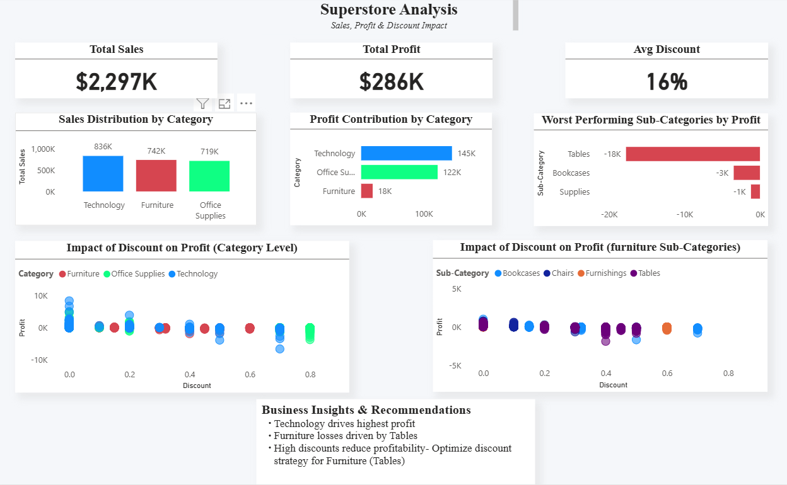

# 📊 Superstore Sales & Profit Analysis (Power BI)

## 📌 Project Overview
This project analyzes retail sales data to uncover insights into sales performance, profitability, and the impact of discounting across product categories.

The goal was not just to visualize data, but to identify underlying business problems and provide actionable insights.

---

## 🎯 Key Objectives
- Analyze sales and profit distribution across categories
- Identify underperforming segments
- Understand the impact of discounting on profitability
- Drill down into sub-category level performance

---

## 📊 Key Insights

- Technology drives the highest profit among all categories  
- Furniture underperforms despite strong sales  
- Tables are the primary loss driver within Furniture  
- Higher discounts significantly reduce profitability  

---

## 💡 Business Recommendation

Optimize discount strategies, especially for Furniture (Tables), to improve overall profitability.

---

## 🛠️ Tools Used
- Power BI  
- Data Analysis  
- Data Visualization  

---

## 📷 Dashboard Preview

---

## 📁 Files Included
- Power BI Dashboard (.pbix)
- Dataset (.csv)
- Dashboard Screenshot (.png)

---

## 🚀 What I Learned
- Going beyond surface-level analysis
- Identifying root causes of business problems
- Translating data into actionable insights
